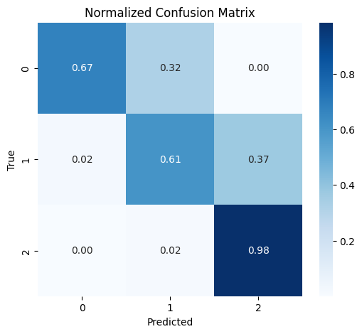
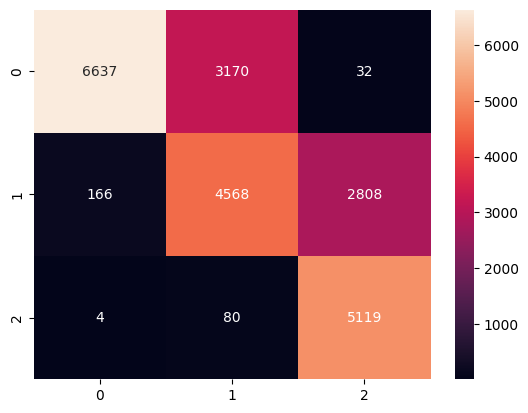
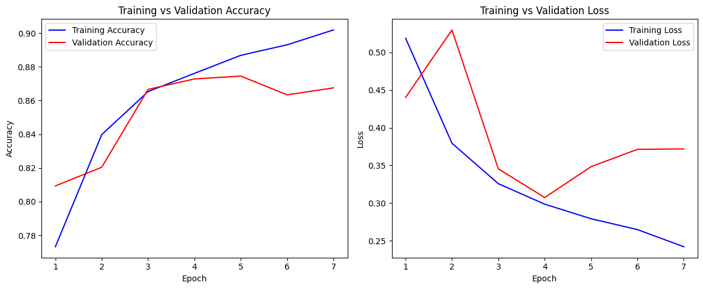
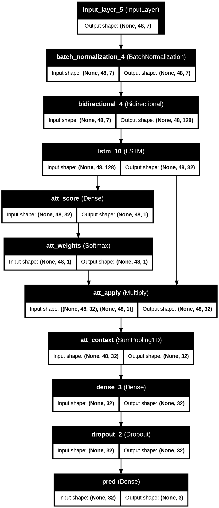

# AI-Driven Paddy Microclimate Stress Classifier

**Hybrid Agronomic Labels + Deep Sequential Modeling (2023–2024)**

[Project Report (PDF)](Project_Report.pdf)

This repository contains the full pipeline for classifying short-term paddy microclimate stress using hybrid physiologically informed labels and a hierarchical BiLSTM-LSTM sequence model. The system processes 48-hour weather sequences from six diverse Indian agroclimatic zones and evaluates geographic robustness through a strict Leave-One-Location-Out (LOLO) protocol.

---

## Project Structure

```
project_root/
│
├── data/                          # Raw and processed weather data per location
│
├── Output/                        # Generated sequences (.npy), metrics, evaluation dumps
│   ├── X_sequences.npy            # 48-hour sequence arrays
│   ├── y_labels.npy               # Corresponding stress labels
│   └── additional evaluation files
│
├── Graphs/                        # Confusion matrices, attention plots, training curves
│
├── model/                         # Saved models, weights, checkpoints
│
├── helper_func.py                 # Utilities (hybrid labels, ET0, VPD, gradients)
├── irrigation_label.py            # Physiology + atmospheric deficit stress labeling
├── sequence.py                    # 48-hour sliding window sequence generator
├── lstm_training_with_norm.py     # Main training script for BiLSTM-LSTM
├── csv_read.py                    # Data loading + preprocessing
├── test.py                        # Quick inference/testing utilities
│
├── requirements.txt               # Dependencies
├── pyproject.toml                 # Environment configuration
└── README.md                      # Documentation
```

---

for classifying short-term paddy microclimate stress using hybrid physiologically informed labels and a hierarchical BiLSTM-LSTM sequence model. The system processes 48-hour weather sequences from six diverse Indian agroclimatic zones and evaluates geographic robustness through a strict Leave-One-Location-Out (LOLO) protocol.

---

## Part of a Larger Agriculture Advisory System

This project forms one module of a broader, multi-component **Agriculture Advisory System** designed to support irrigation planning, microclimate monitoring, and data-driven crop stress forecasting for farmers across diverse Indian agroclimatic zones.

---

## Key Visualizations

The repository includes several important diagnostic plots stored in the `Graphs/` directory:

### Confusion Matrix

Shows classification performance across low, medium, and high stress classes.


### Stress Heatmap

Highlights distribution of predicted vs. true labels under the LOLO split.


### Calibration Curve

Evaluates probability calibration and overconfidence tendencies.


### Training & Validation Curves

Displays model convergence and generalization behavior.


### BiLSTM Attention Map (Post-hoc)

Indicates which hours inside the 48-hour window contributed most to the decision.


---

## Dataset Overview

Six Indian rice-growing agroclimatic zones:

* Assam – Humid subtropical
* Punjab – Semi-arid
* Uttar Pradesh – Subhumid
* West Bengal – Humid monsoon
* Tamil Nadu – Tropical wet
* Andhra Pradesh – Coastal tropical (main LOLO test region)

Features per timestamp:

* Temperature
* Relative humidity
* VPD (derived)
* Precipitation
* Wind speed
* ET0 (FAO-56 Penman–Monteith)
* Soil moisture
* Shortwave radiation
* Temporal gradients (ΔT, ΔRH, ΔVPD)
* Rolling means (6–12 h)

Data covers **January 2023 – December 2024**.

---

## Column Standardization

Raw data contains inconsistent names and units. All columns are normalized using this mapping:

```python
col_map = {
    "temperature_2m (°C)": "temperature_2m",
    "relative_humidity_2m (%)": "relative_humidity_2m",
    "precipitation (mm)": "precipitation",
    "wind_speed_10m (km/h)": "wind_speed_10m",
    "et0_fao_evapotranspiration (mm)": "et0_fao_evapotranspiration",
    "soil_moisture_0_to_7cm (m³/m³)": "soil_moisture",
    "shortwave_radiation_instant (W/m²)": "shortwave_radiation"
}
```

Generic cleaner for handling spaces, superscripts, units, and symbols:

```python
def clean_col(col):
    col = col.lower()
    col = col.replace(" ", "_")
    col = col.replace("(", "").replace(")", "")
    col = col.replace("°c", "degc")
    col = col.replace("%", "pct")
    col = col.replace("km/h", "kmph")
    col = col.replace("³", "3").replace("²", "2")
    col = col.replace("/", "_")
    return col

df.columns = [clean_col(c) for c in df.columns]
```

This ensures consistent feature names across all locations before sequence construction.

---

## Hybrid Agronomic Stress Labeling

Labels combine two components:

### 1. Physiology-based thresholds

(heat + humidity stress)

* Temperature > 33°C
* RH < 50%
* Mean VPD > 2.0–2.2 kPa
* Heat accumulation / consecutive hot hours

### 2. Atmospheric water deficit

48-hour cumulative **ET0 − P**:

* 15–40 mm → Medium stress
* ≥40 mm → High stress

### Final label

* **High:** physiology ≥4 or deficit ≥40 mm
* **Medium:** physiology ≥2 or deficit 15–40 mm
* **Low:** otherwise

This creates stable, biologically meaningful stress classes across climates.

---

## Model Architecture

**BiLSTM → LSTM → Dense (Softmax)**

* Bidirectional LSTM captures symmetric temporal patterns
* Forward LSTM stabilizes sequence representation
* Softmax predicts 3 stress classes
* Lightweight post-hoc attention for interpretability only (not trained jointly)

---

## Training & Evaluation

### Split Strategy

Strict **Leave-One-Location-Out (LOLO)** protocol. Visakhapatnam is held out for the main evaluation due to extreme coastal humidity volatility.

### Metrics

* Accuracy
* Macro-F1 / Micro-F1
* Balanced Accuracy
* ROC-AUC (macro & micro)
* Precision–Recall AUC
* MCC
* Log Loss & Brier Score
* Expected Calibration Error (ECE)
* Confusion Matrix

---

## Key Results (Visakhapatnam LOLO)

* **Accuracy:** 73.39%
* **Macro-F1:** 0.7368
* **Balanced Accuracy:** 0.755
* **Macro ROC-AUC:** 0.924
* **High-stress Recall:** 0.9914

### Baseline Comparison

| Model               | Accuracy   | Macro-F1   |
| ------------------- | ---------- | ---------- |
| Logistic Regression | 66.57%     | 0.6636     |
| Random Forest       | 68.44%     | 0.6912     |
| 1-layer LSTM        | 71.24%     | 0.7128     |
| **BiLSTM–LSTM**     | **73.39%** | **0.7368** |

---

## Running the Pipeline

### 1. Install dependencies

```
pip install -r requirements.txt
```

### 2. Clean and load data

```
python csv_read.py
```

### 3. Generate sequences

```
python sequence.py
```

### 4. Train the model

```
python lstm_training_with_norm.py
```

Outputs are saved to `/model/`, `/Graphs/`, and `/Output/`.

---
### Author

Anand Ambastha
[LinkedIn](https://www.linkedin.com/in/anand-kumar05)

## Special Thanks

Special thanks to the CMU 11-785 TAs for helping clarify doubts even though they were not obligated to support this project. This work was undertaken as part of the CMU 11-785 (Fall 2025) course.

## Future Work

* Transformer-based architectures
* Stage-aware (phenology-aware) stress modeling
* Soil-moisture integration via hydrological models or satellites
* Multi-modal fusion (NDVI, canopy temperature)
* Field-level validation studies


